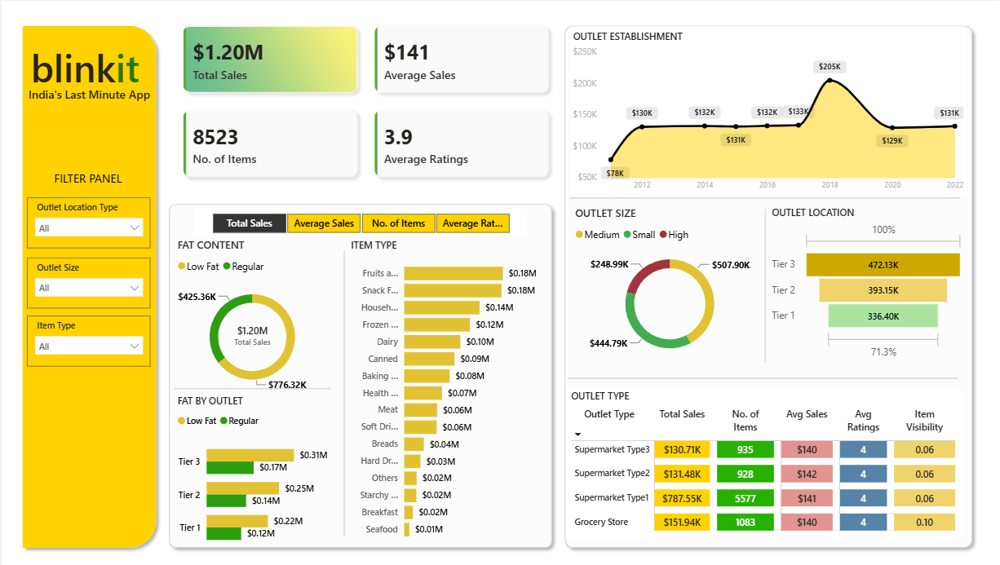

# 🛒 Blinkit Retail Analytics Dashboard

## 📷 Dashboard Preview

---

# 📌 Project Overview

This Power BI dashboard analyzes Blinkit's retail sales data to monitor sales performance, outlet efficiency, customer preferences, and product trends. It provides interactive business insights through KPI cards, charts, and slicers.

---

# 🎯 Business Objective

To help business stakeholders evaluate sales performance, understand customer buying patterns, analyze outlet performance, and identify high-performing product categories for better business decisions.

---

# 📈 Key KPIs

- Total Sales
- Average Sales
- Number of Items
- Average Rating

---

# 📊 Dashboard Features

- Outlet Establishment Trend
- Sales by Outlet Size
- Sales by Outlet Location
- Sales by Outlet Type
- Sales by Item Type
- Fat Content Analysis
- Interactive Matrix Report

### Interactive Filters

- Outlet Location Type
- Outlet Size
- Item Type

---

# 🛠 Tools & Technologies

- Power BI
- DAX
- Power Query
- Microsoft Excel

---

# 📂 Dataset

Blinkit Grocery Sales Dataset

---

# 💡 Key Insights

- Tier 3 outlets generated the highest sales.
- Regular fat products contributed more revenue than low-fat products.
- Fruits, Snacks, Household, and Frozen Foods were among the top-selling categories.
- Grocery Stores achieved the highest average sales compared to supermarket formats.
- Interactive slicers enable detailed outlet and product performance analysis.

---

# 🚀 Skills Demonstrated

- Data Cleaning
- Power Query
- DAX Measures
- Data Modeling
- KPI Development
- Retail Analytics
- Business Intelligence
- Dashboard Design
- Interactive Reporting
- Data Visualization
